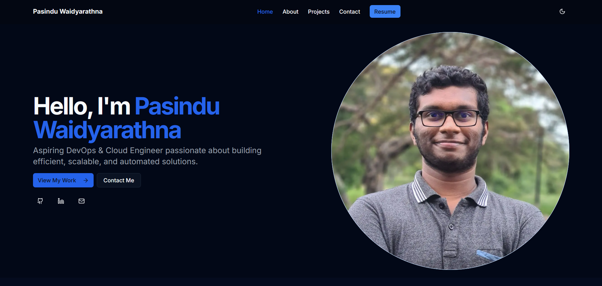

# My Portfolio Website

This is my personal portfolio website built with Next.js, Tailwind CSS, and Framer Motion. The website includes sections for Home, About, Projects, and Contact. It features a responsive design with dark mode support and smooth animations.

## Table of Contents
- [Features](#features)
- [Technologies](#technologies)
- [Setup](#setup)
- [Usage](#usage)
- [Contact](#contact)
- [Screenshots](#Screenshots)


## Features

- **Home**: A visually appealing introduction with animated elements.
- **About**: Detailed information about my background, skills, and experience.
- **Projects**: Showcases my portfolio of work with detailed project pages.
- **Contact**: A form for users to send me messages directly.
- **Dark Mode**: Toggle between light and dark themes.
- **Responsive Design**: Optimized for all device sizes from mobile to desktop.

## Technologies

- **Next.js**: React framework for production-grade applications.
- **Tailwind CSS**: Utility-first CSS framework for rapid UI development.
- **Framer Motion**: Animation library for React applications.
- **Lucide Icons**: Beautiful, consistent icon set.
- **TypeScript**: Static type-checking for JavaScript.
- **Shadcn UI**: Reusable component library built with Radix UI and Tailwind CSS.
- **Docker**: Containerization platform to build and run the application in isolated environments.
  
## Setup

To run this project locally, follow these steps:

1. **Clone the repository**
    ```bash
    git clone https://github.com/PasinduWaidyarathna/Portfolio-N.git
    cd Portfolio-N
    ```

2. **Install dependencies**
    ```bash
    npm install
    ```

3. **Start the development server**
    ```bash
    npm run dev
    ```

Your portfolio website should now be running on [http://localhost:3000](http://localhost:3000).


Also you can run project using docker

1. **Clone the repository**
    ```bash
    git clone https://github.com/PasinduWaidyarathna/Portfolio-N.git
    cd Portfolio-N
    ```
    and go to project file directory,
   
3. **Build the Docker image**
     ```bash
   docker build -t nextjs-portfolio .
    ```
   
4. **Run the Docker container**
     ```bash
   docker run -d -p 3000:3000 nextjs-portfolio
    ```

Your portfolio website should now be running on http://localhost:3000.


## Usage

Navigate through the different sections of the website:

- **Home**: Read about me and my featured projects.
- **About**: Learn about my background, experience, and skills.
- **Projects**: Browse my portfolio with detailed project information.
- **Contact**: Send me a message through the contact form.
- **Docker**: Run the application in an isolated environment.

### Download CV

Click the "Resume" button in the navigation bar to download my CV.

## Contact

If you have any questions or suggestions, feel free to contact me:

- LinkedIn: [[PasinduWaidyarathna](https://www.linkedin.com/in/pasinduwaidyarathna/)]

## Screenshots



